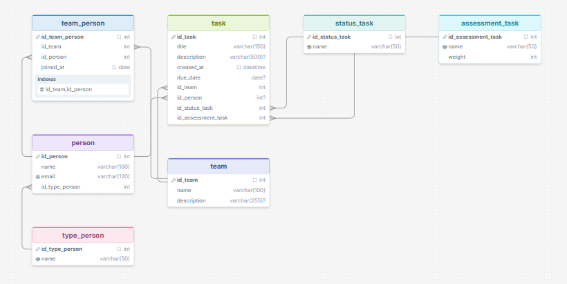

# Gestor de Tareas — Conectado a MySQL


**Desarrollado por:** Kevin Andres Castillo Pabon  
**Skill:** Java  
**Grupo:** J1  

## Descripción del Proyecto

Esta es la segunda fase del proyecto "Gestor de Tareas". En esta iteración, el sistema evoluciona de almacenar datos en archivos de texto a utilizar una base de datos relacional **MySQL** para la persistencia. La aplicación sigue un modelo Entidad-Relación (E-R) estructurado para administrar personas, equipos, tareas, estados de tareas y evaluaciones.

El gestor cuenta con dos interfaces:
- **Interfaz gráfica (Swing):** Proporciona una tabla interactiva con colores por prioridad, creación de tareas, asignación a personas y cambio de estados.
- **Interfaz de consola:** Una versión alternativa funcional mediante línea de comandos para operaciones básicas.

## Normalización de la Base de Datos

El diseño de la base de datos ha sido estructurado siguiendo las reglas de normalización para asegurar la integridad de los datos, evitar redundancias y facilitar el mantenimiento:

1. **Primera Forma Normal (1NF):** Todos los atributos son atómicos. Cada tabla tiene una clave primaria definida (ej. `id_person`, `id_task`), y no hay grupos repetitivos.
2. **Segunda Forma Normal (2NF):** Todos los atributos no clave dependen completamente de la clave primaria. Por ejemplo, en la tabla intermedia `team_person`, tanto el `id_team` como el `id_person` forman la clave primaria compuesta, y cualquier posible atributo extra dependería de esa combinación. En `task`, detalles como título y descripción dependen solo de `id_task`.
3. **Tercera Forma Normal (3NF):** No existen dependencias transitivas. Por ejemplo, el nombre del tipo de persona se almacena en una tabla independiente `type_person` referenciada mediante clave foránea, en lugar de estar duplicada como texto en la tabla `person`. Lo mismo ocurre con `status_task`.

Este modelo incluye las tablas principales: `person`, `type_person`, `team`, `team_person`, `task`, `status_task` y `assessment_task`.

## 1. Instalar y preparar MySQL

Si no tienes MySQL instalado: https://dev.mysql.com/downloads/installer/

Crea un usuario dedicado para la aplicación (se recomienda no usar `root` desde el código):

```sql
CREATE USER 'gestor_app'@'localhost' IDENTIFIED WITH mysql_native_password BY 'gestor123';
GRANT ALL PRIVILEGES ON gestor_tareas.* TO 'gestor_app'@'localhost';
FLUSH PRIVILEGES;
```

## 2. Crear la base de datos

Ejecuta el script incluido en `sql/modelo_fisico.sql`. Este script crea la base de datos, las 7 tablas, define sus relaciones (claves foráneas) y carga los catálogos base (tipos de persona, estados y prioridades), además de algunos datos de ejemplo:



```bash
mysql -u gestor_app -p < sql/modelo_fisico.sql
```

## 3. Ajustar las credenciales

Si configuraste otro usuario o contraseña, edita el archivo `src/main/java/com/proyecto/gestortareas/util/ConexionBD.java`:

```java
private static final String USUARIO = "gestor_app";
private static final String CLAVE = "gestor123";
```

## 4. Compilar y ejecutar

**Interfaz gráfica (por defecto):**
```bash
mvn compile exec:java
```

**Versión de consola** (opcional):
```bash
mvn compile exec:java -Dexec.mainClass="com.proyecto.gestortareas.Main"
```

La interfaz gráfica abrirá una ventana mostrando las tareas actuales (codificadas por color según su prioridad: rojo=ALTA, naranja=MEDIA, azul=BAJA), con botones para gestionar todo el ciclo de vida de la tarea.

## Estructura del Proyecto

El proyecto sigue la arquitectura estándar de Maven, dividiendo responsabilidades en paquetes lógicos:

```text
gestor-tareas-db/
├── pom.xml                     -> Configuración y dependencias de Maven
├── modelo_uml/                 -> Diagramas e imágenes de arquitectura
│   └── image.png
├── sql/
│   └── modelo_fisico.sql       -> Script DDL y DML inicial (7 tablas + datos base)
└── src/main/java/com/proyecto/gestortareas/
    ├── modelo/                 -> Clases de dominio (POJOs): Person, Team, Task, etc.
    ├── dao/                    -> Data Access Objects (JDBC) para cada tabla
    ├── servicio/
    │   └── TaskService.java    -> Lógica de negocio y manejo de la COLA de revisión
    ├── util/
    │   └── ConexionBD.java     -> Singleton para conexión centralizada a MySQL
    ├── gui/                    -> Componentes de la interfaz gráfica (Swing)
    │   ├── GestorTareasFrame.java   -> Ventana principal (tabla de tareas)
    │   ├── TareaTableModel.java     -> Modelo para el JTable
    │   ├── PrioridadCellRenderer.java -> Personalización visual por prioridad
    │   ├── NuevaTareaDialog.java
    │   ├── AsignarPersonaDialog.java
    │   └── CambiarEstadoDialog.java
    ├── AppSwing.java           -> Punto de entrada para la aplicación Swing
    └── Main.java               -> Punto de entrada para la aplicación de consola
```

## Sobre la cola (Queue)

La clase `TaskService` mantiene una `Queue<Task>` en memoria. Cada tarea nueva entra a una "cola de revisión" al momento de crearse. Un líder de equipo puede ir sacando tareas de esa cola en el mismo orden en que llegaron (FIFO). Esto es intencional para procesar las asignaciones de forma ordenada, complementando las `List` del DAO que sirven para búsquedas y filtros.

